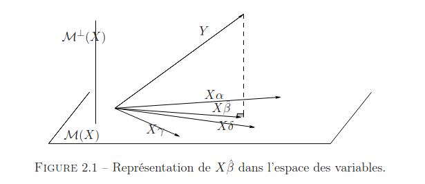

## Rappel : Le Modèle et l'Objectif

En régression multiple, on a un nuage de points dans $\mathbb{R}^n$ (le vecteur $Y$) et on veut trouver le "meilleur plan" (ou droite, ou hyperplan...) qui passe "au plus près" de ces points. Ce "plan" est défini par les variables explicatives (les colonnes de la matrice $X$). Le modèle s'écrit :

$Y = X\beta + \epsilon$

* $Y$ : Le nuage de points qu'on veut expliquer ($n \times 1$).
* $X$ : La matrice des explications ($n \times p$, rang $p$).
* $\beta$ : Les coefficients qu'on cherche ($p \times 1$).
* $\epsilon$ : Les erreurs, ce qui manque ($n \times 1$). Hypothèses MCO : $\mathbb{E}[\epsilon]=0$, $Var(\epsilon)=\sigma^2 I_n$.

On trouve le meilleur $\hat{\beta}$ en minimisant la distance au carré entre $Y$ et le "plan" $X\beta$ : $\min ||Y - X\beta||^2$ (MCO).

---

## L'idée géométrique : Projection

Imagine l'espace $\mathbb{R}^n$.

* **Le point Y :** C'est notre point de départ.
* **Le sous-espace $\mathcal{M}(X)$ :** C'est l'ensemble de tous les points qu'on peut former avec les colonnes de $X$ (combinaisons linéaires $X\alpha$). C'est notre "plan". Sa dimension est $p$.
* **Trouver le plus proche ($\hat{Y}$) :** Le point $\hat{Y}$ dans $\mathcal{M}(X)$ qui est le plus proche de $Y$ est sa **projection orthogonale** sur $\mathcal{M}(X)$ (pense à une ombre projetée à angle droit).

*(Source : Polycopié de cours, Arnaud Guyader)*
* **$\hat{Y}$ et $\hat{\beta}$ :** Puisque $\hat{Y}$ est dans $\mathcal{M}(X)$, il s'écrit $\hat{Y} = X\hat{\beta}$. Le $\hat{\beta}$ qui permet ça est exactement l'estimateur MCO.

---

## La Matrice de Projection $P_X$

C'est l'outil mathématique qui fait la projection :

* **Calcul :** $\hat{Y} = P_X Y$.
* **Formule :** $P_X = X(X'X)^{-1}X'$ .
* **Propriétés :** (Matrice $n \times n$)
    * **Symétrique** : $P_X' = P_X$ .
    * **Idempotente** : $P_X^2 = P_X$ (Projeter 2 fois = projeter 1 fois).
    * **Trace** : $Tr(P_X) = p$ (la dimension de l'espace $\mathcal{M}(X)$).

---

## Les Résidus $\hat{\epsilon}$ et l'Espace Orthogonal $\mathcal{M}^\perp(X)$

* **Définition :** C'est le vecteur qui relie la projection $\hat{Y}$ au point d'origine $Y$ : $\hat{\epsilon} = Y - \hat{Y}$ .
* **Orthogonalité CLÉ :** Le vecteur $\hat{\epsilon}$ est **perpendiculaire** (orthogonal) à *tout* le sous-espace $\mathcal{M}(X)$ .
* **L'espace $\mathcal{M}^\perp(X)$ :** C'est l'ensemble de tous les vecteurs perpendiculaires à $\mathcal{M}(X)$. Sa dimension est $n-p$. $\hat{\epsilon}$ est dedans.
* **La Matrice $P_{X^\perp}$ (Projection sur l'orthogonal) :** C'est $P_{X^\perp} = I_n - P_X$ .
* **Calcul des résidus :** $\hat{\epsilon} = P_{X^\perp} Y$ .
* **Propriétés de $P_{X^\perp}$ :** Symétrique, idempotente, et $Tr(P_{X^\perp}) = n-p$.

---

## Application : Pourquoi la somme des résidus est nulle

C'est une conséquence directe de l'orthogonalité (si le modèle a un intercept)  :

1.  **Avoir un intercept :** Le vecteur $\mathbf{1} = (1, 1, ..., 1)^T$ est dans $\mathcal{M}(X)$.
2.  **Orthogonalité :** $\hat{\epsilon}$ est orthogonal à *tous* les vecteurs de $\mathcal{M}(X)$, donc il est orthogonal à $\mathbf{1}$.
3.  **Produit scalaire nul :** $\hat{\epsilon}' \mathbf{1} = 0$.
4.  **Application :** $\hat{\epsilon}' \mathbf{1} = \sum_{i=1}^n \hat{\epsilon}_i \times 1 = \sum_{i=1}^n \hat{\epsilon}_i$.
5.  **Conclusion :** $\sum_{i=1}^n \hat{\epsilon}_i = 0$.

---

## Application : Théorème de Pythagore

Puisque $\hat{Y}$ et $\hat{\epsilon}$ sont orthogonaux  :
$$||Y||^2 = ||\hat{Y}||^2 + ||\hat{\epsilon}||^2$$ 
C'est ça qui permet de calculer $SCR = ||Y||^2 - ||\hat{Y}||^2$, comme dans l'exercice du CC .

